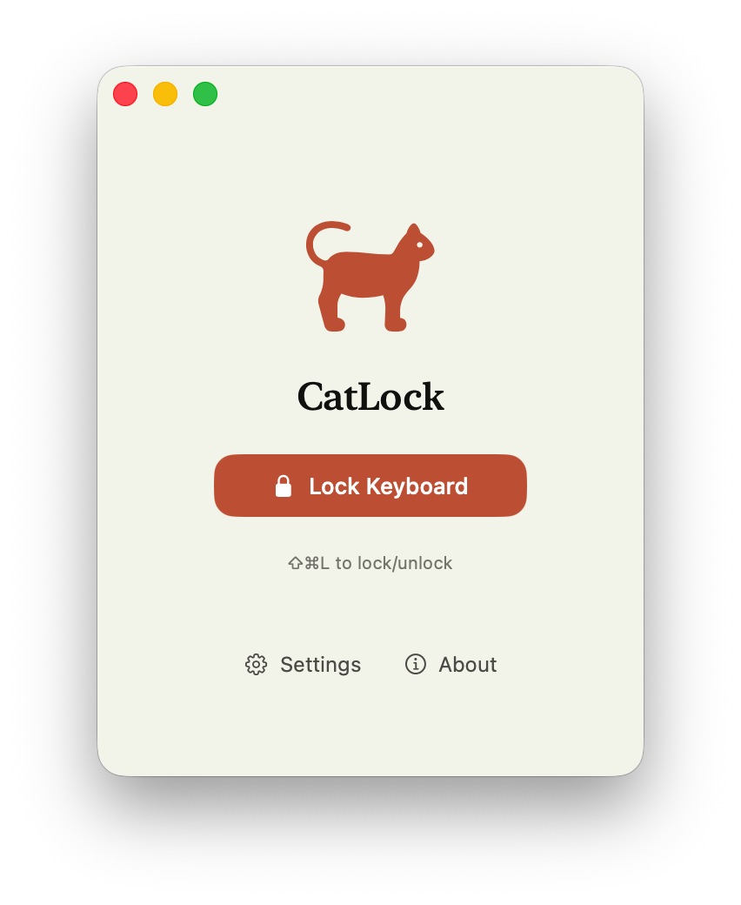
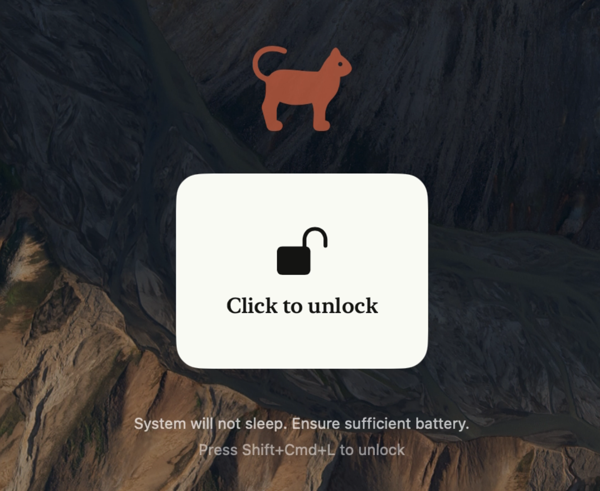
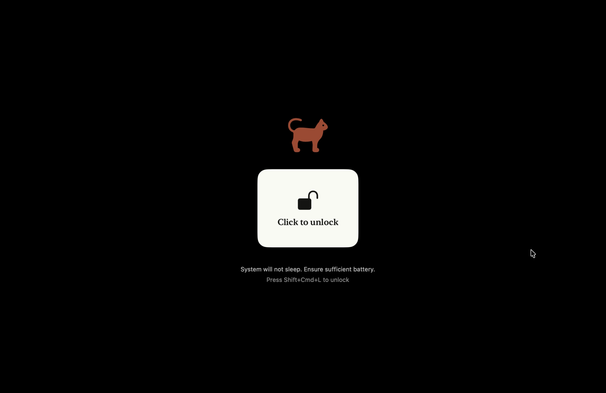
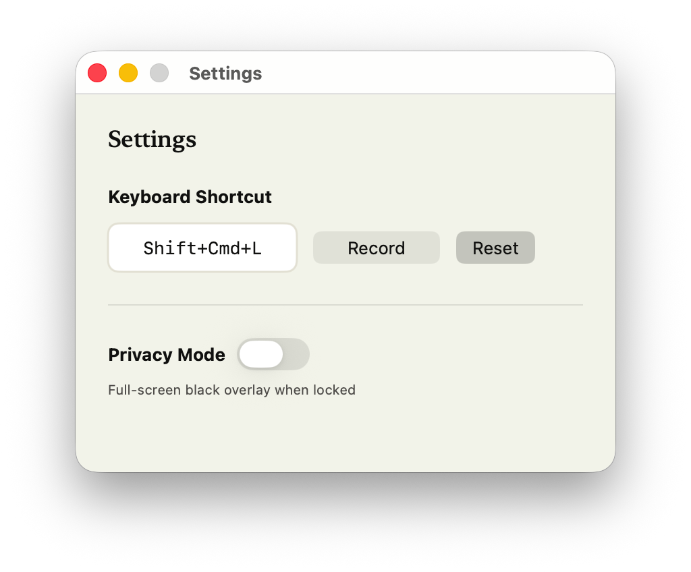

# CatLock

[English](../README.md) | **中文** | [Deutsch](README_de.md)

一款轻量的 macOS 菜单栏小工具，一键锁定键盘和鼠标——专治猫主子踩键盘。

<p align="center">
  
</p>

按下快捷键（默认 `Cmd+Shift+L`）即可锁定所有输入，屏幕上会出现全屏遮罩和解锁按钮。再按一次快捷键或点击按钮就能解锁。

## 功能亮点

- **全局快捷键** — 在任何应用中都能触发，不需要切换到 CatLock 窗口
- **自定义快捷键** — 在设置中录制你喜欢的组合键
- **隐私模式** — 锁定时将屏幕完全遮黑，适合离开工位时使用
- **菜单栏常驻** — 安安静静待在菜单栏，不占 Dock 位置
- **支持 25 种语言** — 自动跟随系统语言
- **防止休眠** — 锁定期间阻止 Mac 进入睡眠，不会打断正在跑的任务

## 锁定模式

锁定后，屏幕上会覆盖一层半透明遮罩。桌面内容依然可见，但所有键盘和鼠标输入都会被拦截。

<p align="center">
  
</p>

## 隐私模式

需要暂时离开？在设置中打开隐私模式，遮罩会变成全黑，完全遮挡屏幕内容。

<p align="center">
  
</p>

## 设置

自定义快捷键，一键开关隐私模式。

<p align="center">
  
</p>

## 为什么需要 CatLock？

猫踩键盘打出一串乱码、小朋友一顿乱按把文件删了、擦键盘的时候不小心触发了什么奇怪的快捷键——这些场景 CatLock 都能搞定。它在系统层面拦截所有输入事件，锁定后任何按键和鼠标操作都不会传递给应用程序。

## 工作原理

CatLock 利用 macOS 的 CGEvent tap 机制，在输入事件到达应用程序之前就将其拦截。平时有一个轻量的监听 tap 在后台运行，专门检测快捷键；锁定后会启动第二个 tap，屏蔽除解锁快捷键以外的所有输入。首次使用时需要授予辅助功能权限。

## 安装

1. 从 [Releases](../../releases) 页面下载最新的 `.dmg` 文件
2. 打开 `.dmg`，把 CatLock 拖进「应用程序」文件夹
3. 打开 CatLock，macOS 会弹出安全提示 — 点击「完成」（别点"移到废纸篓"）
4. 打开「系统设置 → 隐私与安全性」，往下翻，点击「仍然打开」
5. CatLock 会请求辅助功能权限 — 点击按钮跳转到系统设置中授权即可

> **为什么会有安全提示？** CatLock 是开源免费软件，代码完全公开。弹出提示是因为没有使用 Apple 付费开发者证书（$99/年）进行签名，并不代表软件有安全问题。

## 从源码构建

```
git clone https://github.com/hou-physics/CatLock.git
cd CatLock
xcodebuild -scheme CatLock -configuration Release build
```

构建产物位于 `~/Library/Developer/Xcode/DerivedData/CatLock-*/Build/Products/Release/CatLock.app`。

## 系统要求

- macOS 14.0 或更高版本
- 辅助功能权限（首次使用时会提示授权）

## 开源协议

GPL-3.0
